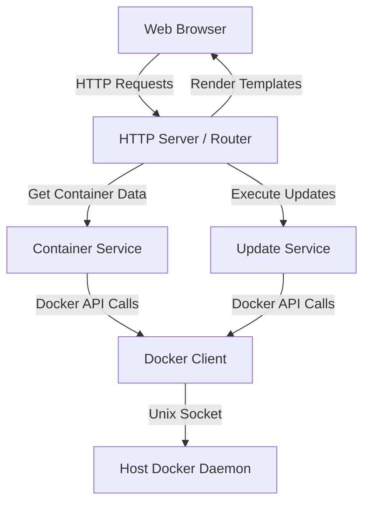

# Design Document

## Overview

BleedingEdge is a lightweight web application built with Go and htmx that monitors Docker containers and keeps them up to date. The application uses a simple architecture with a Go backend that interfaces with the Docker daemon and serves HTML pages enhanced with htmx for dynamic updates without JavaScript frameworks.

**Technology Stack:**
- **Backend**: Go 1.21+ with the official Docker SDK
- **Frontend**: HTML templates with htmx and Alpine.js for minimal interactivity
- **Styling**: Simple CSS (or Tailwind CSS via CDN for rapid development)
- **Deployment**: Docker container with access to host Docker socket

**Design Principles:**
- Lightweight: Minimal dependencies, small binary size
- Simple: Focus on core update functionality
- Reliable: Comprehensive error handling and logging
- Fast: Efficient Docker API usage and caching where appropriate

## Architecture

### High-Level Architecture



### Application Layers

1. **HTTP Layer**: Handles web requests, routing, and template rendering
2. **Service Layer**: Business logic for container management and updates
3. **Docker Client Layer**: Abstraction over Docker SDK for testability
4. **Docker Daemon**: Host Docker daemon accessed via Unix socket

### Directory Structure

```
bleeding-edge/
├── cmd/
│   └── server/
│       └── main.go              # Application entry point
├── internal/
│   ├── docker/
│   │   ├── client.go            # Docker client wrapper
│   │   └── client_test.go
│   ├── models/
│   │   └── container.go         # Data models
│   ├── services/
│   │   ├── container.go         # Container listing and grouping
│   │   ├── container_test.go
│   │   ├── update.go            # Update operations
│   │   └── update_test.go
│   └── handlers/
│       ├── home.go              # Grid view handler
│       ├── detail.go            # Detail view handler
│       ├── operations.go        # Lifecycle operations handler
│       └── handlers_test.go
├── web/
│   ├── templates/
│   │   ├── layout.html          # Base layout
│   │   ├── grid.html            # Container grid
│   │   └── detail.html          # Container detail
│   └── static/
│       └── styles.css           # Minimal CSS
├── Dockerfile
├── docker-compose.yml           # Example deployment
├── go.mod
└── go.sum
```

## Components and Interfaces

### 1. Docker Client Wrapper

**Purpose**: Provide a testable interface to the Docker SDK

**Interface**:
```go
type DockerClient interface {
    ListContainers(ctx context.Context) ([]types.Container, error)
    InspectContainer(ctx context.Context, id string) (types.ContainerJSON, error)
    PullImage(ctx context.Context, image string) error
    GetImageDigest(ctx context.Context, image string) (string, error)
    StartContainer(ctx context.Context, id string) error
    StopContainer(ctx context.Context, id string) error
    RestartContainer(ctx context.Context, id string) error
    RemoveContainer(ctx context.Context, id string) error
    CreateContainer(ctx context.Context, config *container.Config, hostConfig *container.HostConfig, name string) (string, error)
    ExecuteCommand(ctx context.Context, workDir string, command string, args []string) error
}
```

**Implementation Notes**:
- Wraps the official Docker SDK (`github.com/docker/docker/client`)
- Provides context-aware operations with timeouts
- Returns structured errors for better error handling

### 2. Container Service

**Purpose**: Manage container listing, grouping, and status checking

**Key Functions**:
```go
// GetContainerGroups returns all containers grouped by compose project
func GetContainerGroups(ctx context.Context, client DockerClient) ([]ContainerGroup, error)

// CheckUpdates pulls latest images and compares digests
func CheckUpdates(ctx context.Context, client DockerClient, groups []ContainerGroup) error

// IsComposeProject checks if container is part of compose project
func IsComposeProject(container types.Container) (bool, string)
```

**Data Flow**:
1. List all containers from Docker daemon
2. Inspect each container for labels
3. Group containers by `com.docker.compose.project` label
4. For each unique image, pull latest and compare digests
5. Mark containers/groups with update status

**Grouping Logic**:
- Containers with `com.docker.compose.project` label are grouped together
- Standalone containers are treated as single-container groups
- Each group tracks: project name, containers, working directory, update status

### 3. Update Service

**Purpose**: Execute update operations for containers and compose projects

**Key Functions**:
```go
// UpdateComposeProject updates all containers in a compose project
func UpdateComposeProject(ctx context.Context, client DockerClient, projectName, workDir string, containers []string) error

// UpdateStandaloneContainer updates a single manually-run container
func UpdateStandaloneContainer(ctx context.Context, client DockerClient, containerID string) error

// ExtractContainerParams extracts all parameters from a running container
func ExtractContainerParams(container types.ContainerJSON) (*ContainerParams, error)
```

**Update Flow for Compose Projects**:
1. Pull latest images for all containers in project
2. Execute `docker compose down` in working directory
3. Execute `docker compose up -d --build` in working directory
4. Return success or detailed error

**Update Flow for Standalone Containers**:
1. Inspect container to get full configuration
2. Extract all parameters (ports, volumes, env vars, networks, etc.)
3. Pull latest image
4. Stop and remove old container
5. Create new container with same parameters and new image
6. Start new container
7. Return success or detailed error

**Parameter Extraction**:
Must preserve:
- Image name and tag
- Port bindings
- Volume mounts
- Environment variables
- Network connections
- Restart policy
- Labels
- Command and entrypoint overrides
- Resource limits (memory, CPU)
- Capabilities and security options

### 4. HTTP Handlers

**Purpose**: Handle web requests and render responses

**Handlers**:

**GET /**
- Lists all containers grouped by compose project
- Triggers update check on page load
- Renders grid view with update status

**GET /container/:id**
- Shows detail page for container or compose group
- Displays all containers in group if compose project
- Shows update button if updates available

**POST /container/:id/update**
- Executes update for container or compose group
- Returns htmx response with success/error message
- Updates UI dynamically

**POST /container/:id/start**
**POST /container/:id/stop**
**POST /container/:id/restart**
- Executes lifecycle operation
- Returns htmx response with result
- Updates container status in UI

## Data Models

### ContainerGroup

```go
type ContainerGroup struct {
    ID              string              // Unique identifier (container ID or project name)
    Name            string              // Display name
    Type            GroupType           // "compose" or "standalone"
    Containers      []ContainerInfo     // List of containers in group
    WorkingDir      string              // For compose projects
    HasUpdates      bool                // True if any container has updates
    AllRunning      bool                // True if all containers running
}

type GroupType string

const (
    GroupTypeCompose    GroupType = "compose"
    GroupTypeStandalone GroupType = "standalone"
)
```

### ContainerInfo

```go
type ContainerInfo struct {
    ID            string
    Name          string
    Image         string
    ImageDigest   string
    LatestDigest  string
    State         string              // "running", "stopped", "exited"
    HasUpdate     bool
    Labels        map[string]string
}
```

### ContainerParams

```go
type ContainerParams struct {
    Image          string
    Name           string
    Env            []string
    Cmd            []string
    Entrypoint     []string
    PortBindings   nat.PortMap
    Binds          []string
    Networks       []string
    RestartPolicy  container.RestartPolicy
    Labels         map[string]string
    Resources      container.Resources
}
```

### OperationResult

```go
type OperationResult struct {
    Success   bool
    Message   string
    Error     string
    Timestamp time.Time
}
```

## Error Handling

### Error Categories

1. **Docker Connection Errors**: Cannot connect to Docker daemon
2. **Image Pull Errors**: Cannot pull image from registry
3. **Container Operation Errors**: Cannot start/stop/restart container
4. **Compose Errors**: Cannot execute compose commands
5. **Parameter Extraction Errors**: Cannot extract container configuration

### Error Handling Strategy

**At Docker Client Layer**:
- Wrap all Docker SDK errors with context
- Add operation type and container/image name to errors
- Log all errors with structured logging

**At Service Layer**:
- Catch and categorize errors
- Add business context to errors
- Return structured error responses

**At Handler Layer**:
- Convert errors to user-friendly messages
- Render error messages in UI
- Log errors with request context

**Error Response Format**:
```go
type ErrorResponse struct {
    Operation   string    // "update", "start", "stop", etc.
    Container   string    // Container or project name
    Message     string    // User-friendly message
    Details     string    // Technical details
    Timestamp   time.Time
}
```

### Logging

- Use structured logging (e.g., `log/slog` from Go 1.21+)
- Log levels: DEBUG, INFO, WARN, ERROR
- Include context: operation, container ID/name, duration
- Log all Docker API calls at DEBUG level
- Log all errors at ERROR level with full stack trace

## Testing Strategy

### Unit Tests

**Docker Client Mock**:
- Create mock implementation of DockerClient interface
- Use for testing services without real Docker daemon

**Service Layer Tests**:
- Test container grouping logic with various label combinations
- Test update status detection with different digest scenarios
- Test parameter extraction with various container configurations
- Test error handling for all failure scenarios

**Handler Tests**:
- Test HTTP responses for all endpoints
- Test template rendering with various data
- Test error response formatting

### Integration Tests

**Docker-in-Docker Tests**:
- Use testcontainers-go library
- Spin up real Docker daemon in test
- Create test containers with various configurations
- Test actual update operations
- Test compose project detection and updates

**Test Scenarios**:
1. Standalone container with simple configuration
2. Standalone container with complex configuration (volumes, networks, env vars)
3. Compose project with multiple containers
4. Mixed environment (standalone + compose)
5. Container with no updates available
6. Container with updates available
7. Failed image pull
8. Failed container recreation

### Test Coverage Goals

- Unit test coverage: >80%
- Integration test coverage for critical paths: 100%
- All error paths tested

## Deployment

### Dockerfile

```dockerfile
FROM golang:1.21-alpine AS builder
WORKDIR /app
COPY go.mod go.sum ./
RUN go mod download
COPY . .
RUN CGO_ENABLED=0 GOOS=linux go build -o bleeding-edge ./cmd/server

FROM alpine:latest
RUN apk --no-cache add ca-certificates docker-cli docker-cli-compose
WORKDIR /root/
COPY --from=builder /app/bleeding-edge .
COPY --from=builder /app/web ./web
EXPOSE 8080
CMD ["./bleeding-edge"]
```

**Key Points**:
- Multi-stage build for small image size
- Include docker-cli and docker-compose for executing compose commands
- Copy web assets for template rendering
- Expose port 8080 (configurable via environment variable)

### Docker Compose Deployment

```yaml
version: '3.8'
services:
  bleeding-edge:
    build: .
    ports:
      - "8080:8080"
    volumes:
      - /var/run/docker.sock:/var/run/docker.sock:ro
    environment:
      - PORT=8080
      - LOG_LEVEL=info
    restart: unless-stopped
```

### Environment Variables

- `PORT`: HTTP server port (default: 8080)
- `LOG_LEVEL`: Logging level (default: info)
- `DOCKER_HOST`: Docker daemon address (default: unix:///var/run/docker.sock)
- `UPDATE_CHECK_TIMEOUT`: Timeout for update checks (default: 5m)

### Security Considerations

- Docker socket is mounted read-write (required for updates)
- Application has full Docker access - should be deployed in trusted environment
- No authentication built-in - should be behind reverse proxy with auth if exposed
- Consider using Docker socket proxy for additional security layer

## UI Design

### Grid View (Home Page)

**Layout**: CSS Grid with responsive columns (1-4 columns based on screen size)

**Each Card Shows**:
- Project/Container name (large, bold)
- Status indicator (green dot = running, gray = stopped)
- Update badge (orange/red if updates available)
- Number of containers (for compose projects)
- Click to view details

**Visual Indicators**:
- Green border: All up to date and running
- Orange border: Updates available
- Gray: Stopped containers
- Badge with number: Compose project with N containers

### Detail View

**Header Section**:
- Project/Container name
- Type indicator (Compose Project / Standalone Container)
- Overall status

**Container List** (for compose projects):
- Table with columns: Name, Image, Status, Update Available
- Individual status indicators per container

**Actions Section**:
- Large "Update" button (prominent if updates available)
- Start/Stop/Restart buttons for each container
- Buttons disabled during operations

**Status Messages**:
- Success messages in green banner
- Error messages in red banner with details
- Operation in progress indicator

### htmx Integration

**Dynamic Updates**:
- Update button triggers POST with htmx
- Response replaces status section
- No full page reload needed
- Progress indicators during operations

**Example htmx Attributes**:
```html
<button hx-post="/container/abc123/update" 
        hx-target="#status-section"
        hx-indicator="#spinner">
    Update
</button>
```

## Performance Considerations

### Caching Strategy

- Cache container list for 10 seconds to avoid excessive Docker API calls
- Cache image digests for 5 minutes
- Invalidate cache after any update operation

### Concurrent Operations

- Use goroutines for parallel image pulls during update check
- Limit concurrent pulls to avoid overwhelming registry
- Use context with timeout for all Docker operations

### Optimization

- Lazy load container details (only inspect when viewing detail page)
- Stream Docker API responses where possible
- Use connection pooling for Docker client

## Future Enhancements (Out of Scope)

- Scheduled automatic updates
- Webhook notifications
- Multi-host support
- Authentication and authorization
- Update rollback capability
- Container health monitoring
- Resource usage metrics
